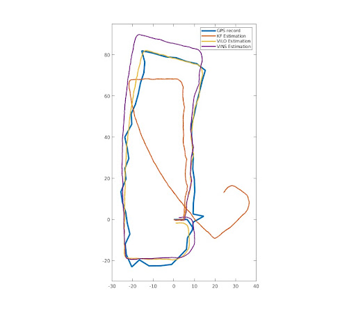
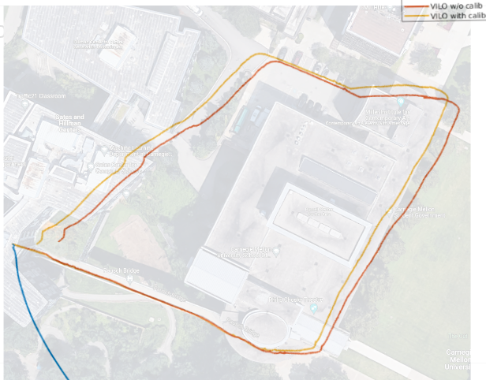
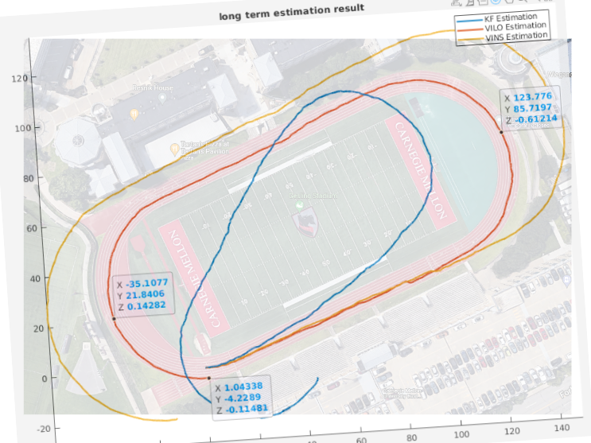
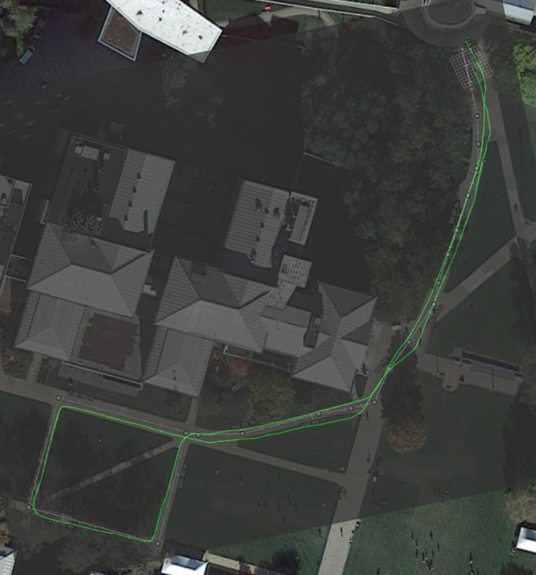

## Introduction
This ROS package contains a visual-inertial-leg odometry (VILO) for Unitree A1 and Go1 robot. Our goal is to provide a compact and low-cost long term position sensing suite for legged robots (A sensing solution only has one IMU, one stereo camera, and leg sensors. Total cost <$1000).

The focus of this work is adding body velocity calculated from leg joint sensors and calibrate potential kinematic parameter errors to improve its accuracy when used in VILO. This odometry uses the optimization framework from the VINS-Fusion, one of the most popular visual inertial odometry. Additional to VINS's image and IMU measurement model, we add a special contact preintegration term. It achieves lower than 1\% position estimation drift on various datasets. More details of the theoratical contribution can be found in our recent papers:

* **Online Kinematic Calibration for Legged Robots**, Yang, Shuo and Choset, Howie and Manchester, Zachary, IEEE Robotics and Automation Letters (& IROS 2022), [pdf](https://ieeexplore.ieee.org/abstract/document/9807408)

* **Cerberus: Low-Drift Visual-Inertial-Leg Odometry For Agile Locomotion**, Yang, Shuo and Zhang, Zixin and Fu, Zhengyu and Manchester, Zachary. (paper accepted to ICRA 2023) [pdf](https://arxiv.org/abs/2209.07654)

If you use Cerberus for your academic research, please cite at least one of our related papers.


Here are two videos comparing the performance of the Cerberus VILO and the VINS-Fusion:
[](https://www.youtube.com/watch?v=jq9ijL9z3RI)

[](https://www.youtube.com/watch?v=oNwwQ0l-O4U)


## Installation
git clone the repo (remember to initialize submodules):
```shell
git clone --recurse-submodules git@github.com:ShuoYangRobotics/Cerberus.git
```

Use Docker and VSCode ''Remote - Containers''. A **devcontainer.json** that configures the development environment is shown in .devcontainer folder. If you have Nvidia GPU on your computer this file will autmatically setup the docker container to use GPU (so you can open rviz inside docker). If not, you need to comment out devcontainer.json line 7.

### Data visualization
If you works on Linux machine with Nvidia GPU. To open rviz, first on your local machine, run the following command to allow docker container to open GUI on your local machine:
```
xhost +
```

The docker configuration file should allow users to open rviz inside the docker container. But as we said earlier it only works smoothly on Linux machine with Nvidia GPU. If you are using Mac or Windows, you can still install the dockere container but I don't know how to enable GUI for rviz. [This tutorial](https://github.com/ShuoYangRobotics/A1-QP-MPC-Controller/blob/main/README.md#setup) may help. But I always recommend to use Linux with Nvidia GPU.


## Demo Datasets
A Google drive folder https://drive.google.com/drive/folders/13GsFDaBkDrslOl9BfE4AJnOn3ECDXVnc

contains several dataset to test the VILO. Download them to \${PATH_TO_CODE_REPO}/bags. Since we directly map the code into a location inside the docker (/home/EstimationUser/estimation_ws/src/Cerberus/). If we download dataset rosbag to 
\${PATH_TO_CODE_REPO}/bags, the bag file will appear in the docker container as well (/home/EstimationUser/estimation_ws/src/Cerberus//bags). 

### List of bags and how to run them
Connect to remote container, make sure you have bags in /home/EstimationUser/estimation_ws/src/Cerberus/bags

1. street.bag. A1 robot. Traveled 260m in 590s (average speed 0.44m/s), suburban environment
```shell
roslaunch vilo run_street_bag_vilo.launch
```


2. campus.bag. Go1 robot. Traveled 350m in 350s (average speed 1.0m/s), indoor and outdoor campus environment
```shell
roslaunch vilo run_campus_bag_vilo.launch
```


3. track.bag. A1 robot. Traveled 450m in 590s (average speed 0.76m/s), stadium running track.
```shell
roslaunch vilo run_track_bag_vilo.launch
```


4. cut.bag. Go1 robot. Traveled 450m in 450s (average speed 1.0m/s), Outdoor campus environment
```shell
roslaunch vilo run_cut_bag_vilo.launch
```


5. outdoor_snow.bag. A1 robot. Traveled ~30m in 80s (average speed 0.38m/s), in heavy snow.
```shell
rosbag play -r 0.7 --clock outdoor_snow.bag
roslaunch vilo hardware_a1_vilo.launch
```

Notice the rosbag play should be slow down for slow computers, otherwise the VILO cannot finish computation in time. In the launch files we play them at 0.5x original speed.

## Check Results
While the algorithm is running, a number of ROS topics contain estimation results will be published. Moreover in the output/ folder some of estimation results will be saved in csv files.

## Custom Sensor Setup
The VILO can only works properly when sensor topics are received correctly and all sensor transformations are set properly. 

We use the "outdoor_snow.bag" dataset to overview the sensor data frequency and format. Command "rosbag info outdoor_snow.bag" shows the following information
```
version:     2.0
duration:    1:41s (101s)
start:       Jan 18 2022 15:27:10.62 (1642537630.62)
end:         Jan 18 2022 15:28:52.55 (1642537732.55)
size:        949.0 MB
messages:    120363
compression: none [1020/1020 chunks]
types:       sensor_msgs/Image      [060021388200f6f0f447d0fcd9c64743]
             sensor_msgs/Imu        [6a62c6daae103f4ff57a132d6f95cec2]
             sensor_msgs/JointState [3066dcd76a6cfaef579bd0f34173e9fd]
topics:      /camera_forward/infra1/image_rect_raw    1529 msgs    : sensor_msgs/Image     
             /camera_forward/infra2/image_rect_raw    1529 msgs    : sensor_msgs/Image     
             /hardware_a1/imu                        48466 msgs    : sensor_msgs/Imu       
             /hardware_a1/joint_foot                 48452 msgs    : sensor_msgs/JointState
             /imu/data                               20387 msgs    : sensor_msgs/Imu

```
For dataset with ground truth position, an additonal topic "/mocap_node/mocap/pose" is in the bag. The data type is "geometry_msgs/PoseStamped".

From the info list, the most important topics are 

1. **/camera_forward/infra1/image_rect_raw**   -  sensor_msgs/Image - 15 Hz

   **/camera_forward/infra2/image_rect_raw**   -  sensor_msgs/Image - 15 Hz

   They comes from a realsense camera. It is very hard to get the image right because infra cameras will not be useful if infra light emitter is not turned off. In A1_launch there is a launch file for reading realsense camera and handle the emitter setting (a1_launch/launch/front_camera_read.launch).

2. **/hardware_a1/imu**  -  sensor_msgs/Imu - 500Hz

   This is the output from A1 robot. The topic comes from Unitree's API. In Unitree API a topic with type "LowState" contains all the robot data. But we separate IMU data and leg data to make it generic. Because other robots may not be archtected in this way 

3. **/imu/data**   -  sensor_msgs/Imu - 200Hz

   This IMU data comes from an expensive IMU called XSens Mti-200, which is not directly used in our algorithm. It is just used for reference to benchmark the orientation measurement of A1 IMU. It turns out the A1 IMU performs very well comparing to XSens Mti-200, which is a $3000 sensor. So you can be convinced that A1's performance is good

4. **/hardware_a1/joint_foot**  - sensor_msgs/JointState - 500Hz
 

   This is another part of the "LowState". The structure of this JointState can be seen from its name list: There are 16 JointStates in this topic. The first 12 contains motor joint information, and the last four contains foot contact sensor reading. There is not a standard ROS topic to represent all of them so I created this topic. 

   One caviet when users create the same topic is, the joint velocities directly generated by A1 robot is very noisy. My controller differentiates joint angles to generate joint velocities. 

